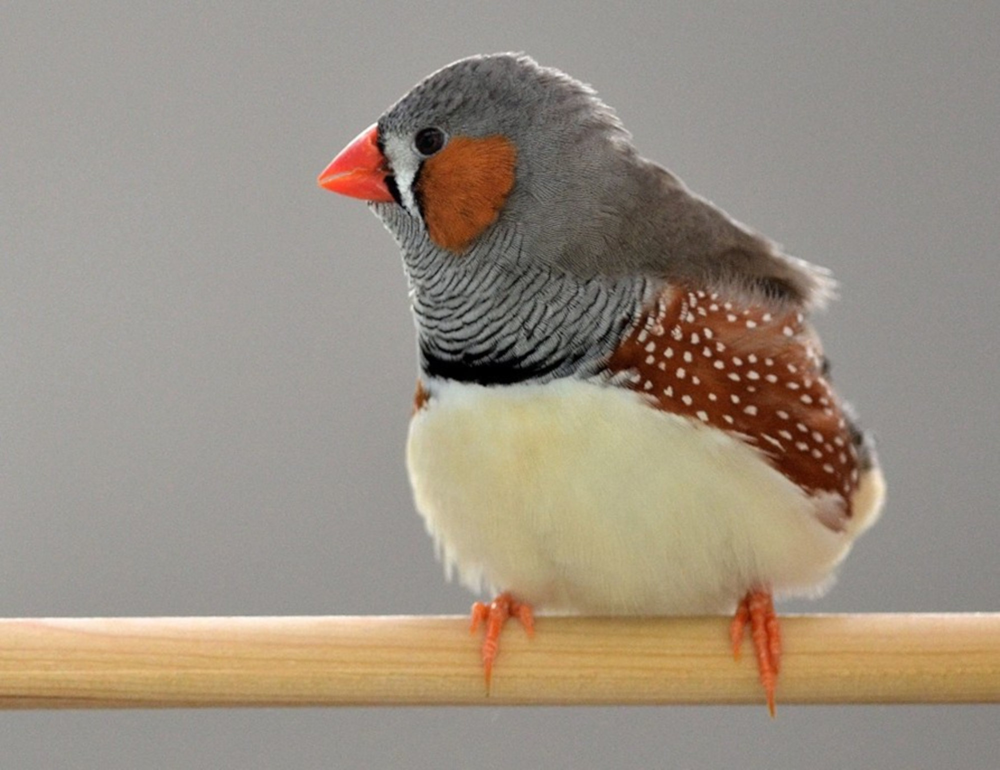

Some species exhibit a striking polymorphism in appearance or behaviour. Such within-species diversity is often encoded by so-called “supergenes”, large blocks of DNA that occur in two forms, either in a regular sequence order or in an inverted sequence order (“inversion polymorphism”). As the two versions are unable to recombine, they can evolve in independent directions, allowing remarkable specialization within a species. However, not all inversion polymorphisms cause dramatic phenotypic effects. In the present study, we scanned the entire zebra finch genome and discovered that at least 6 out of the 40 chromosomes of this species carried large inversions, with the inverted version occurring at high frequency in both captive and wild populations. None of these inversions appear to have drastic effects on the appearance of the birds. We aim to understand why these mutations that once arose in a single individual (some 0.6 to 2.2 million years ago) have risen to such high allele frequencies (currently 29-43%). To find out more, read here.

[@pei2025evolution]

{width=40%}
