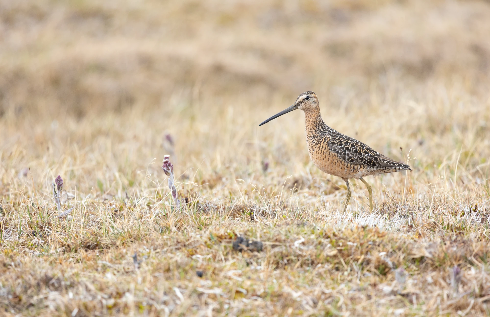

Bart was recently interviewed by Popular Science magazine about long-term partnerships in birds. Find out what he had to say on the topic [here](https://www.popsci.com/science/do-animals-mate-for-life/).

{width=40%}
