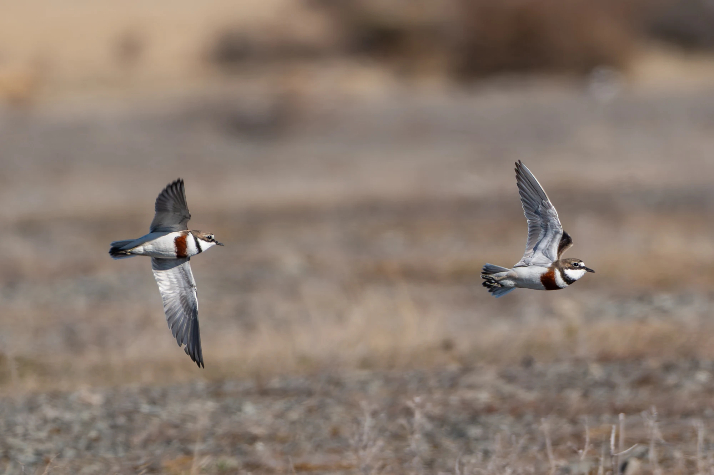

Banded Dotterels (_Anarhynchus bicinctus_) breed exclusively in New Zealand, but show remarkably variation in their seasonal movements. While some individuals remain in New Zealand year-round, others migrate across the Tasman Sea to spend the non-breeding season in Australia. How is the timing of this unique east–west migration changing over time? Using citizen science observations, we show that arrival in Australia has become progressively later over the past 12 years, while the timing of departure back to New Zealand has not changed. Later arrival in Australia was associated with positive values of the Southern Annular Mode at the end of the breeding season. This large-scale climate pattern is associated with milder weather conditions in New Zealand. Thus, our findings suggest that Banded Dotterels are rapidly changing their timing of migration, linked to changes in climate. However, the mechanisms underlying this change remain unclear and require further investigation. 

[@10.1111/ibi.70128]

{width=40%}
