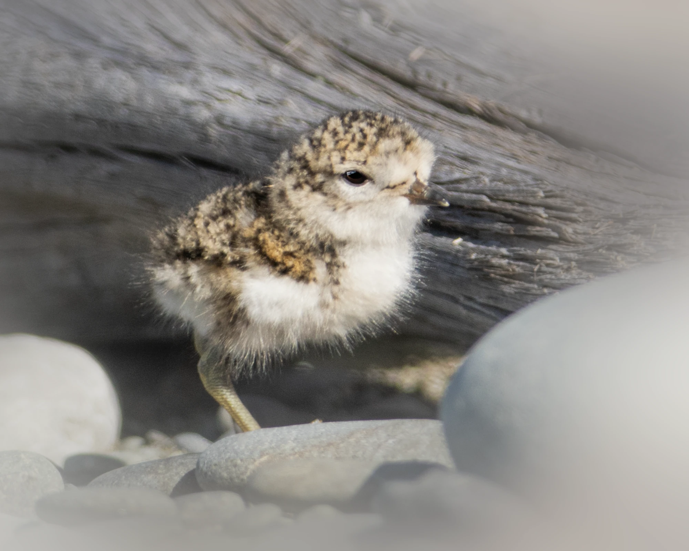

Because wader chicks are highly vulnerable, avoiding being seen by predators is crucial for their survival. However, we know relatively little about how young birds behave to camouflage themselves. We are studying this in the Banded Dotterel, a wader species that only nests in New Zealand. In what ways have these dotterels specialized for camouflage in their native habitats, and how might modern human-driven environment changes impact their ability to hide? 

To test these questions, we have built the game “Dotterel Finder”. To play, simply click the link here, and try to find as many hiding dotterel chicks as you can. Playing once takes just 3 to 6 minutes. Thank you for participating!

{width=40%}
