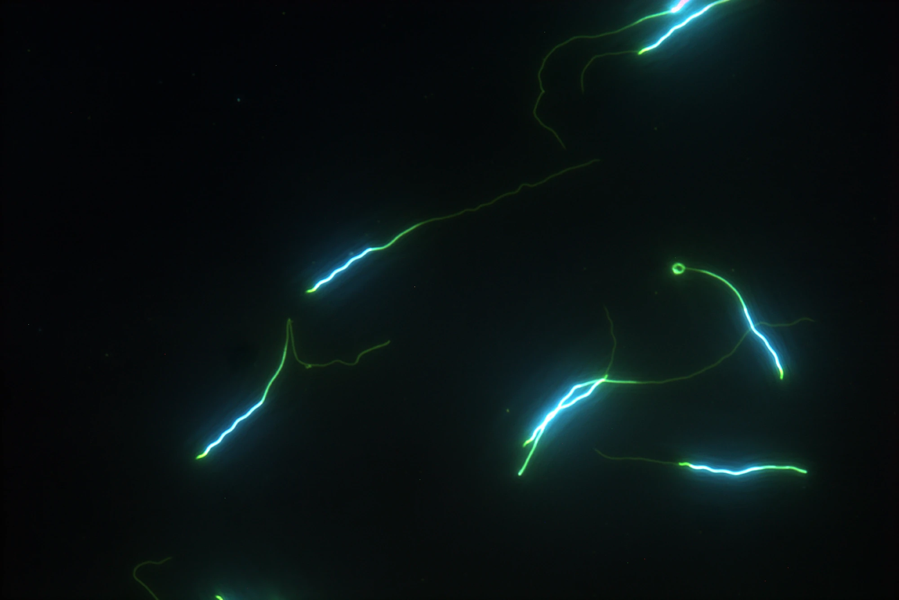

Multiple studies in birds have investigated the interplay between levels of sperm competition and testis size, sperm morphology and sperm motility. However, little is known about the molecular underpinnings of traits related to sperm competition. We scanned for recent selection in the genome of two polygynous shorebird species (the pectoral sandpiper and the ruff) using population genomic methods. We also tested for historical selection in a set of six sandpiper species (*Calidris* spp.) using phylogenetic methods. All three tests revealed genes functioning in the axoneme of sperm flagella as targets of dynamic selection in these sandpiper species. Our study suggests that sperm competition in birds may not only select for longer sperm, but also cause a modified force-producing machinery in the sperm.

[@mueller2026genes]

{width=40%}
