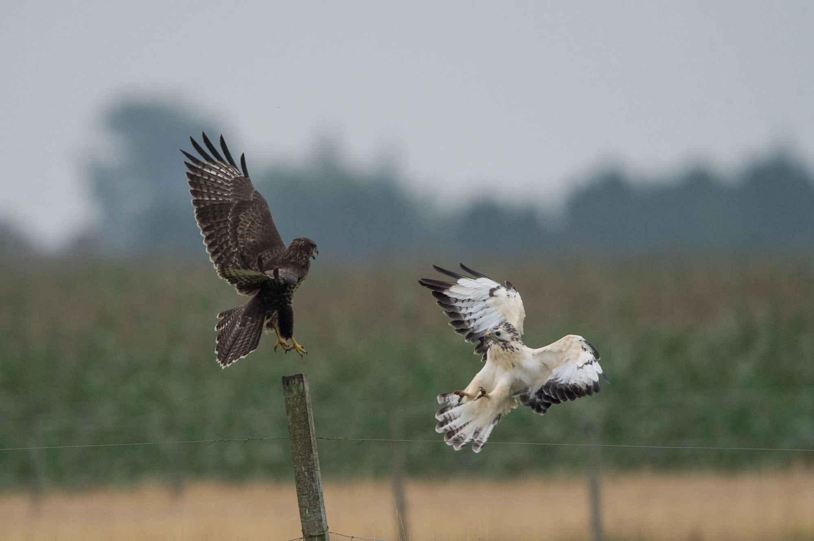

The common buzzard (*Buteo buteo*) shows large variation in plumage colour: some individuals are dark brown, whereas others are almost entirely white. What factors underlie or maintain this variation? To identify these factors, we investigated the spatiotemporal distribution of plumage colour variation. We analysed almost 100,000 buzzard observations, collected across more than two decades by citizen scientists throughout Europe. Observers scored colour morph using seven categories from dark through intermediate to light. Our study shows (1) that there is geographical variation in plumage colour, and (2) that the proportion of intermediately-coloured buzzards significantly increased across the years of data collection (2000 to 2022), at the expense of the extreme morphs (dark and light). The change in buzzard colour over time in a given area was associated with a decline in forest cover, suggesting a causal link between the two. The decrease in buzzard colour morph variation may affect the ability of the species to adapt to environmental changes, if reduced colour variation reflects lower genetic diversity. More work is needed to determine whether this is indeed the case.

[@delhey2026environmental]

{width=40%}
