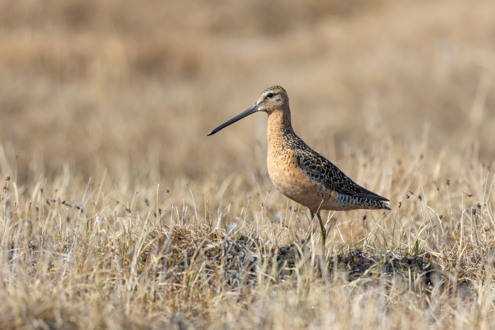

In some migratory bird species, almost all individuals return to the same breeding site year after year, whereas in others, most individuals move to a different breeding area each year. Although this between-species variation in site fidelity has important consequences for population structure, disease transmission, and adaptability to habitat change, it remains largely unexplained. Using a dataset of 189 estimates of local return rates from 55 shorebird species, we show that breeding site fidelity decreases with increasing latitude. However, this effect was driven entirely by low return rates in birds breeding in arctic tundra habitat. The Arctic is characterized by high spatial and temporal variability in snow cover and in predation risk, and a relatively short breeding season. These conditions may favour a flexible settlement strategy, leading to low between-year site fidelity. Our results more generally demonstrate how an apparent global latitudinal pattern may arise from processes within a single biome. For more details, see our paper in Ecography, and a [press release](https://www.bi.mpg.de/news/2026-09-2-kempenaers) issued by MPI-BI on the study.

[@10.1002/ecog.08440]

{width=40%}
