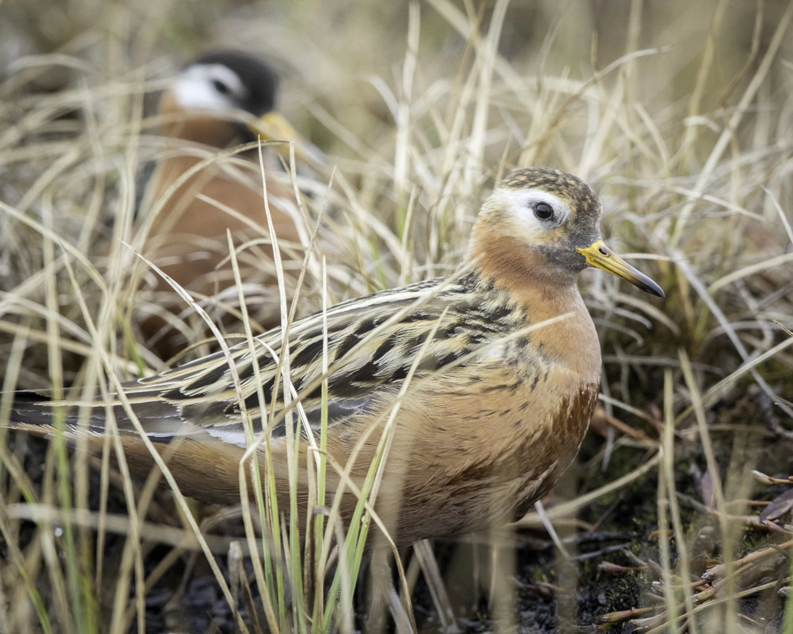

When birds breed in multiple years, they can either return to their former breeding site or disperse to a new area. The degree of breeding site fidelity often differs between the sexes in relation to the mating system of a species. However, most research has focused on species with conventional sex roles. We monitored local return rates in an Arctic-breeding population of the sex-role reversed red phalarope. Breeding site fidelity was much higher in males than in females, consistent with predictions about site fidelity in species with a female-access polyandrous mating system. We also found that site fidelity is associated with local breeding performance, even in a species that shows a reversal of typical sex-roles, where individuals do not defend a territory and breed in an environment that is highly unpredictable between years. The findings of our study are published in the latest issue of *Behavioral Ecology*. 

[@santema2026factors]

{width=40%}
